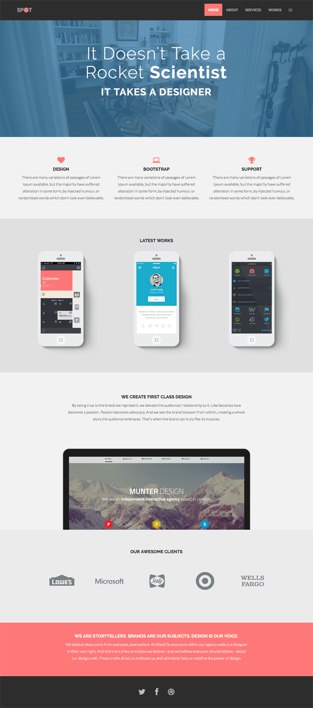

# Challenge_CSS15
Auteur : Jessica Anschutz 

Intégration d'une maquette en HTML/CSS 

## Consignes 

- Gérer tous les survols du design.
- Le design doit conserver sa structure sur au moins Firefox et Chrome.
- Les images ne doivent pas être déformées.
- Un respect maximal des dimensions.
- Réalisation en Sass, Bootstrap n'est pas autorisé, juste du css.

## Maquette

- [Demo du site](http://blacktie.co/demo/spot/)

